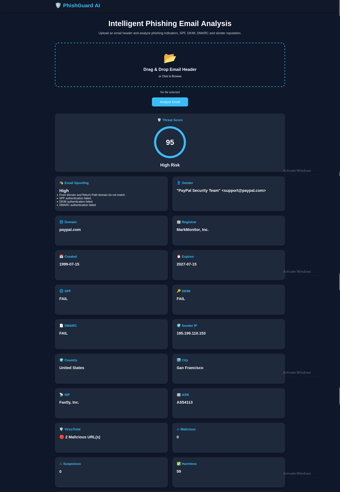
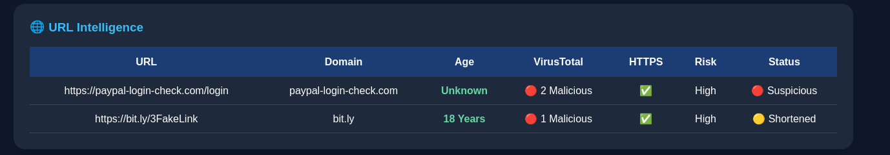
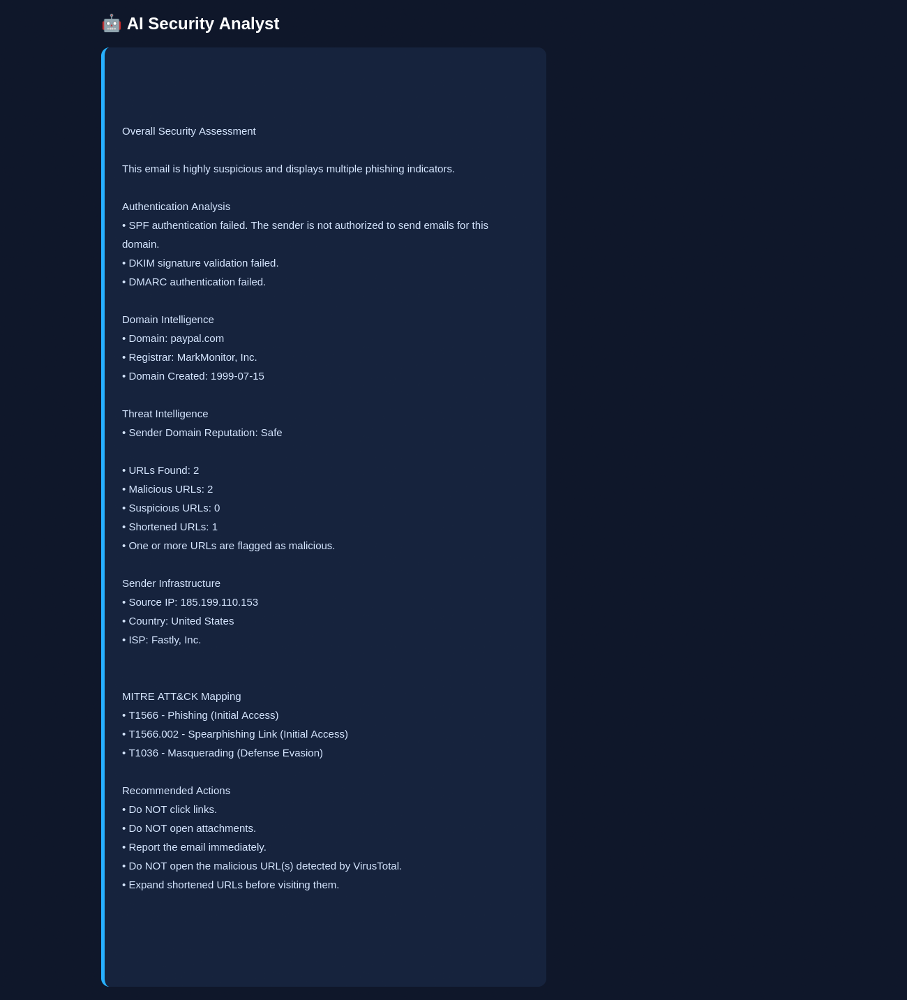
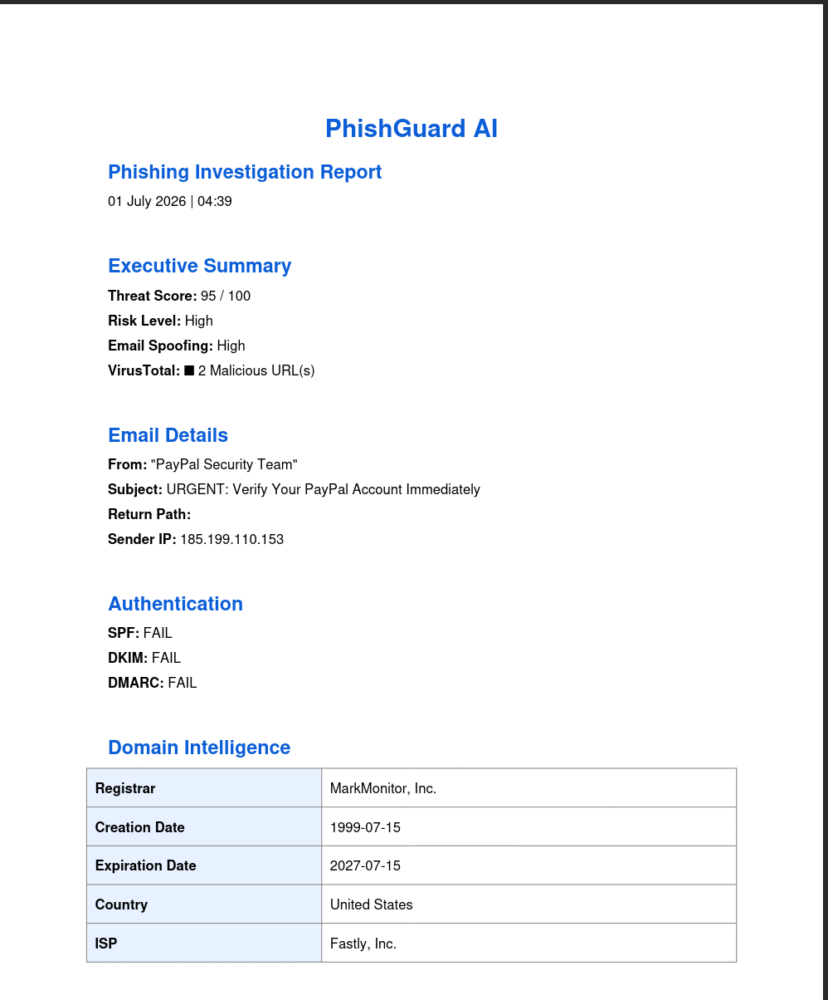

# 🛡️ PhishGuard AI

An AI-powered phishing email analysis platform built with **Python**, **Flask**, and multiple threat intelligence sources.

PhishGuard AI analyzes raw email headers to detect phishing attacks using authentication analysis, threat intelligence, IOC extraction, MITRE ATT&CK mapping, AI-generated investigation reports, and downloadable forensic reports.

---

# 📸 Dashboard



---

# 🚀 Features

## 📧 Email Header Analysis
- Parse raw email headers
- Extract sender information
- Analyze Return-Path
- Detect spoofed senders
- Extract sender IP
- Subject analysis

---

## 🔐 Email Authentication

- SPF Validation
- DKIM Validation
- DMARC Validation
- Email Spoofing Detection

---

## 🌍 Threat Intelligence

### WHOIS Lookup

- Registrar
- Domain Creation Date
- Expiration Date
- Country

### IP Intelligence

- Country
- City
- ISP
- ASN

### VirusTotal Integration

- Domain Reputation
- Malicious URLs
- Suspicious URLs
- Harmless Score

---

# 🌐 URL Intelligence

Automatically extracts URLs from emails and analyzes them using multiple indicators.

Features:

- URL Extraction
- Domain Extraction
- HTTPS Detection
- URL Age
- VirusTotal Reputation
- Risk Classification
- Shortened URL Detection

### Screenshot



---

# 🚨 Indicators of Compromise (IOC)

Automatically extracts forensic indicators from the email.

Supported IOC Types

- Email Address
- Domains
- IP Address
- URLs
- Subject

Export Options

- CSV Export
- JSON Export

---

# 🎯 MITRE ATT&CK Mapping

Maps detected phishing indicators to the MITRE ATT&CK Framework.

Currently Supported

| Technique ID | Technique | Tactic |
|--------------|-----------|--------|
| T1566 | Phishing | Initial Access |
| T1566.002 | Spearphishing Link | Initial Access |
| T1036 | Masquerading | Defense Evasion |

### Screenshot


---

# 🤖 AI Security Assessment

Automatically generates an investigation report summarizing:

- Executive Summary
- Authentication Analysis
- Domain Intelligence
- Threat Intelligence
- Infrastructure Analysis
- MITRE ATT&CK Mapping
- Security Recommendations

### Screenshot



---

# 📄 Professional PDF Report

Generate a professional forensic investigation report containing:

- Executive Summary
- Email Details
- Authentication Results
- Domain Intelligence
- URL Intelligence
- IOC Table
- MITRE ATT&CK Mapping

### Screenshot



---

# ⚙️ Technology Stack

## Backend

- Python
- Flask
- SQLite

## Threat Intelligence

- VirusTotal API
- WHOIS
- IP Geolocation

## Frontend

- HTML5
- CSS3
- JavaScript

## PDF Generation

- ReportLab

---

# 📂 Project Structure

```text
phishing-analyzer/
│
├── app.py
├── analyzer.py
├── pdf_report.py
├── database.py
├── config.py
├── ioc_export.py
├── requirements.txt
│
├── static/
│   ├── css/
│   ├── js/
│   └── images/
│
├── templates/
│
├── uploads/
├── reports/
├── logs/
└── samples/
```

---

# ⚡ Installation

## Clone Repository

```bash
git clone https://github.com/YOUR_USERNAME/phishguard-ai.git
```

```bash
cd phishguard-ai
```

---

## Create Virtual Environment

Linux

```bash
python3 -m venv venv
```

Activate

```bash
source venv/bin/activate
```

Windows

```bash
python -m venv venv
```

```bash
venv\Scripts\activate
```

---

## Install Dependencies

```bash
pip install -r requirements.txt
```

---

## Configure Environment

Create a `.env` file.

```env
VT_API_KEY=YOUR_VIRUSTOTAL_API_KEY
```

---

## Run Application

```bash
python app.py
```

Open

```
http://127.0.0.1:5000
```

---

# 🛠 Example Workflow

1. Upload an email header (.txt)
2. Parse authentication records
3. Analyze SPF, DKIM and DMARC
4. Perform WHOIS lookup
5. Query VirusTotal
6. Analyze URLs
7. Extract IOCs
8. Map to MITRE ATT&CK
9. Generate AI Investigation Report
10. Export PDF / CSV / JSON

---

# 🔮 Future Improvements

- OpenAI-powered phishing explanation
- QR code phishing detection
- Attachment malware analysis
- Email body NLP analysis
- AbuseIPDB Integration
- AlienVault OTX Integration
- MISP Integration
- Multi-language support
- Docker Deployment
- User Authentication
- Analyst Dashboard

---

# 👨‍💻 Author

**Surya Kadam**

Cybersecurity Student | SOC Analyst Enthusiast | Blue Team | Threat Detection

GitHub:
https://github.com/suryakadam17
---

# ⭐ Support

If you found this project useful, consider giving it a ⭐ on GitHub.
